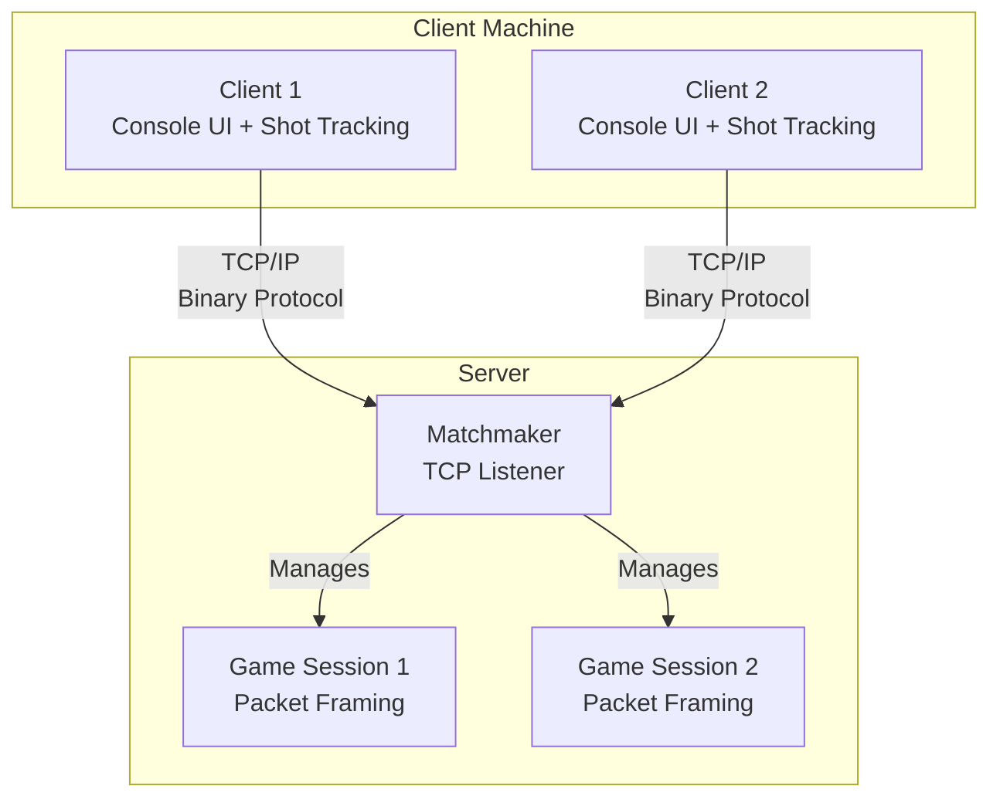

# Architecture Overview

This document provides a deep dive into the architectural decisions, design patterns, and principles that make the Distributed Battleship engine a robust and maintainable system.

## System Context

The system is a client-server architecture designed for real-time multiplayer gameplay with interactive console UI and robust packet framing.



- **Clients**: Interactive console UI with shot tracking, clean output management, and binary protocol communication.
- **Matchmaker**: TCP listener that pairs waiting clients into new game sessions with proper packet handling.
- **Game Sessions**: Isolated contexts with robust packet framing for reliable TCP communication.

## SOLID Principles in Practice

### 1. Single Responsibility Principle (SRP)

Each class and library has a single, well-defined reason to change.

- **`Battleship.Logic`**: Contains only game rules (hit detection, ship placement, win conditions). It has no knowledge of networking or UI.
- **`Battleship.Shared`**: Defines the domain models and the binary protocol with packet framing. It knows nothing about how a game is played or how clients connect.
- **`Battleship.Server`**: Manages TCP connections, packet framing, matchmaking, and session state. It does not contain game rules.
- **`Battleship.Client`**: Interactive console UI with shot tracking, clean output management, and network communication. It does not validate game rules.

### 2. Open/Closed Principle (OCP)

The system is open for extension but closed for modification.

The **Packet System** is the primary example of OCP. New packet types can be added without changing the core networking logic.

```csharp
// Interface is closed for modification
public interface IPacket { }

// New packet types can be added by implementing the interface
public class ShotPacket : IPacket { /* ... */ }
public class ChatPacket : IPacket { /* ... */ } // Future extension
```

### 3. Liskov Substitution Principle (LSP)

Derived classes are substitutable for their base classes.

The `INetworkHandler` interface can be implemented by a real `TcpNetworkHandler` or a `MockNetworkHandler` for testing, and the `GameEngine` will work correctly with either.

### 4. Interface Segregation Principle (ISP)

Clients are not forced to depend on interfaces they do not use.

Instead of one large `IGameService` interface, we have smaller, focused interfaces:
- `IGameLogic`: For rule validation.
- `INetworkHandler`: For sending/receiving data.
- `ISessionManager`: For managing player sessions.

### 5. Dependency Inversion Principle (DIP)

High-level modules do not depend on low-level modules.

The `GameEngine` (high-level) depends on the `IGameLogic` interface (abstraction), not a concrete implementation. The server injects the concrete `GameLogic` class at runtime.

## Design Patterns

### 1. State Pattern

The game flow is managed by the State pattern, allowing for clean transitions between different phases of the game.

```csharp
public interface IGameState
{
    IGameState HandleInput(GameContext context, Input input);
    void Enter(GameContext context);
    void Exit(GameContext context);
}

public class LobbyState : IGameState { /* ... */ }
public class PlacementState : IGameState { /* ... */ }
public class BattleState : IGameState { /* ... */ }
public class GameOverState : IGameState { /* ... */ }
```

**Benefits:**
- Eliminates large `switch` or `if/else` blocks.
- Makes adding new game states trivial.
- Encapsulates state-specific behavior.

### 2. Strategy Pattern

The packet serialization system uses the Strategy pattern to handle different data types efficiently.

```csharp
public interface ISerializationStrategy
{
    void Serialize(BinaryWriter writer, object data);
    object Deserialize(BinaryReader reader);
}

public class IntSerializationStrategy : ISerializationStrategy { /* ... */ }
public class StringSerializationStrategy : ISerializationStrategy { /* ... */ }
```

**Benefits:**
- Allows the protocol to be easily extended with new data types.
- Enables the use of optimized serialization strategies for specific types.

### 3. Observer Pattern

The client uses the Observer pattern to react to network events decoupled from the networking code.

```csharp
public interface IGameEventSubscriber
{
    void OnGameStateChanged(GameState newState);
    void OnShotReceived(Coordinate coordinate, ShotResult result);
    void OnOpponentConnected(string playerName);
}
```

**Benefits:**
- The UI can react to game events without knowing about TCP sockets.
- Makes the client more modular and easier to test.

### 4. Factory Pattern

A `PacketFactory` is used to construct the correct packet object from raw binary data.

```csharp
public class PacketFactory
{
    public IPacket CreatePacket(PacketType type, byte[] payload)
    {
        return type switch
        {
            PacketType.Shot => new ShotPacket(payload),
            PacketType.ShotResult => new ShotResultPacket(payload),
            _ => throw new InvalidOperationException($"Unknown packet type: {type}")
        };
    }
}
```

## Concurrency Model

The server is designed to handle multiple concurrent games efficiently using `async/await` and `Task`-based concurrency with robust packet framing.

```csharp
public async Task StartAsync(CancellationToken cancellationToken)
{
    while (!cancellationToken.IsCancellationRequested)
    {
        var client = await _listener.AcceptTcpClientAsync();
        _ = Task.Run(() => HandleClientAsync(client, cancellationToken));
    }
}
```

- **Asynchronous I/O**: All network operations are non-blocking, allowing the server to handle many clients on a few threads.
- **Packet Framing**: Robust TCP stream handling that correctly processes multiple packets in single reads and partial packets across multiple reads.
- **Session Isolation**: Each game session runs in its own logical context, preventing state from leaking between games.
- **Thread Safety**: Shared resources (like the matchmaking queue) are protected using `ConcurrentQueue` and other thread-safe collections.
- **Timer Management**: Placement timers with proper cleanup to prevent resource leaks.

## Data Flow

### Client -> Server
1. User performs an action (e.g., fires a shot) through interactive console UI.
2. Client creates a `ShotPacket`.
3. `BinaryPacketWriter` serializes the packet to a byte array with proper header.
4. `TcpClient` sends the data to the server.
5. Server's packet framing logic buffers and processes complete packets.
6. `BinaryPacketReader` deserializes the complete packet into a `ShotPacket` object.
7. Server passes the packet to the appropriate `GameSession`.

### Server -> Client
1. Server processes the shot and determines the result.
2. Server creates a `ShotResultPacket`.
3. Server serializes and sends the packet to both clients with proper framing.
4. Client's packet framing logic buffers and processes complete packets.
5. Clients deserialize the packet and update their game state.
6. The UI is notified via the Observer pattern and re-renders the boards with shot tracking.

### UI State Management
1. Console UI tracks shot results in `_opponentShots` dictionary.
2. Board rendering shows 'H' for hits, 'M' for misses, '~' for unexplored.
3. Message flags prevent duplicate console output.
4. Game state transitions trigger proper timer cleanup and UI updates.

## Error Handling and Resilience

- **Graceful Disconnects**: The server detects client disconnections and cleans up game sessions.
- **Packet Framing Validation**: Robust handling of partial packets and multiple packets in single reads.
- **Protocol Validation**: All incoming packets are validated for correct type and length before processing.
- **Exception Isolation**: An exception in one game session does not affect other sessions.
- **Timeouts**: Network operations have timeouts to prevent hanging connections.
- **UI Error Handling**: Clean console output management prevents message clutter and duplicate displays.

## UI Architecture

### Console UI Components
- **Game Loop**: State machine managing Lobby, Placement, Battle, and GameOver phases.
- **Board Rendering**: Dual board display with ship symbols and shot tracking.
- **Input Handling**: Interactive menus for ship placement, firing shots, and game actions.
- **Message Management**: Smart flag-based system to prevent console clutter.

### Shot Tracking System
- **Coordinate Mapping**: Dictionary mapping shot coordinates to results.
- **Visual Feedback**: Real-time board updates with hit/miss indicators.
- **State Synchronization**: Proper coordination between network events and UI updates.

---

## 💡 Key Architectural Learnings

### Design Decision Insights
- **Binary vs Text Protocols**: Binary protocols reduce bandwidth by ~70% compared to JSON but require careful packet framing
- **State Pattern Benefits**: Eliminates complex conditional logic and makes state transitions explicit and testable
- **Interface Segregation**: Small, focused interfaces prevent coupling and enable clean unit testing
- **Concurrency Trade-offs**: Async/await provides better scalability than thread pools for I/O-bound operations

### Implementation Realities
- **TCP Stream Handling**: Packet framing is essential - TCP is a stream protocol, not a message protocol
- **Resource Management**: Timers and network connections require explicit cleanup to prevent memory leaks
- **UI State Synchronization**: Console applications need careful message management to avoid output corruption
- **Error Isolation**: Exceptions in one game session must not affect other concurrent sessions