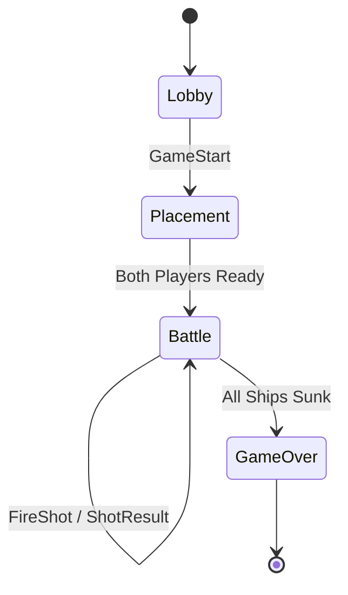

# Binary Protocol Specification

This document defines the custom binary protocol used for communication between the Battleship client and server. The protocol is designed for minimal overhead, high performance, and extensibility.

## Design Goals

1. **Low Latency**: Minimal bytes per packet to reduce serialization and transmission time.
2. **Extensibility**: New packet types can be added without breaking existing clients.
3. **Robustness**: All packets are validated for type and length to prevent corruption.
4. **Platform Independence**: Uses Little Endian byte order for consistency across architectures.

## Packet Structure

Every packet consists of a **Header** and a **Payload**.

```
+------------------ Packet ------------------+
| +---------------- Header ----------------+ |
| | Type (1 byte) | Length (2 bytes)     | |
| +----------------+----------------------+ |
| |                                        | |
| |             Payload (N bytes)          | |
| |                                        | |
| +----------------------------------------+ |
+--------------------------------------------+
```

### Header (3 bytes)

- **Type** (`1 byte`): An unsigned integer that identifies the packet type.
- **Length** (`2 bytes`, `uint16`): The length of the payload in bytes. Stored in Little Endian.

### Payload (Variable Length)

The payload structure is specific to each packet type and is defined below.

## Endianness

All multi-byte numeric values in the protocol are stored in **Little Endian** format. This is consistent with the default byte order on most modern consumer CPUs (x86, x64).

## Packet Types

| Type ID | Name            | Direction          | Payload Description                               |
|---------|-----------------|--------------------|---------------------------------------------------|
| `0x01`  | `FireShot`      | Client → Server    | `[4 bytes: X][4 bytes: Y]`                        |
| `0x02`  | `ShotResult`    | Server → Client    | `[1 byte: Result][1 byte: ShipType (optional)]`   |
| `0x03`  | `PlaceShip`     | Client → Server    | `[1 byte: ShipType][4 bytes: X][4 bytes: Y][1 byte: IsVertical]` |
| `0x04`  | `GameStart`     | Server → Client    | `[1 byte: PlayerID]`                              |
| `0x05`  | `TurnChange`    | Server → Client    | `[1 byte: PlayerID]`                              |
| `0x06`  | `GameOver`      | Server → Client    | `[1 byte: WinnerID]`                              |
| `0x07`  | `Error`         | Server → Client    | `[2 bytes: ErrorCode][N bytes: Message]`         |
| `0x08`  | `Heartbeat`     | Bidirectional      | (No payload)                                      |

## Payload Definitions

### `FireShot` (Type `0x01`)

Sent by a client to fire a shot at a specific coordinate.

**Payload (8 bytes):**
- **X** (`int32`, 4 bytes): The X-coordinate of the shot (0-9).
- **Y** (`int32`, 4 bytes): The Y-coordinate of the shot (0-9).

**Example:**
```
Type: 0x01
Length: 8
Payload: 05 00 00 00 03 00 00 00  // Firing at (5, 3)
```

### `ShotResult` (Type `0x02`)

Sent by the server to all clients to report the result of a shot.

**Payload (1 or 2 bytes):**
- **Result** (`byte`, 1 byte): The outcome of the shot.
  - `0x01` = `Hit`
  - `0x02` = `Miss`
  - `0x03` = `Sunk`
- **ShipType** (`byte`, 1 byte, optional): The type of ship that was sunk. Only present if `Result` is `Sunk`.
  - `0x01` = `Carrier`
  - `0x02` = `Battleship`
  - `0x03` = `Destroyer`
  - `0x04` = `Submarine`
  - `0x05` = `PatrolBoat`

**Example (Hit):**
```
Type: 0x02
Length: 1
Payload: 01  // Hit
```

**Example (Sunk Carrier):**
```
Type: 0x02
Length: 2
Payload: 03 01  // Sunk, ShipType is Carrier
```

### `PlaceShip` (Type `0x03`)

Sent by a client during the placement phase to position a ship on the board.

**Payload (10 bytes):**
- **ShipType** (`byte`, 1 byte): The type of ship being placed.
- **X** (`int32`, 4 bytes): The starting X-coordinate (0-9).
- **Y** (`int32`, 4 bytes): The starting Y-coordinate (0-9).
- **IsVertical** (`byte`, 1 byte): Orientation of the ship (`0x01` for vertical, `0x00` for horizontal).

**Example:**
```
Type: 0x03
Length: 10
Payload: 01 02 00 00 00 03 00 00 00 01  // Place Carrier (1) at (2, 3), vertically
```

### `GameStart` (Type `0x04`)

Sent by the server to indicate that the game is starting and which player the client is.

**Payload (1 byte):**
- **PlayerID** (`byte`, 1 byte): The ID of the receiving player (`1` or `2`).

### `TurnChange` (Type `0x05`)

Sent by the server to indicate which player's turn it is.

**Payload (1 byte):**
- **PlayerID** (`byte`, 1 byte): The ID of the player whose turn it is (`1` or `2`).

### `GameOver` (Type `0x06`)

Sent by the server to indicate that the game has ended.

**Payload (1 byte):**
- **WinnerID** (`byte`, 1 byte): The ID of the winning player (`1` or `2`).

### `Error` (Type `0x07`)

Sent by the server to report an error to the client.

**Payload (Variable Length):**
- **ErrorCode** (`uint16`, 2 bytes): A numeric code for the error.
- **Message** (`string`, N bytes): A UTF-8 encoded error message.

**Error Codes:**
- `0x0001` = `InvalidPacket`
- `0x0002` = `InvalidMove`
- `0x0003` = `GameFull`
- `0x0004` = `ProtocolError`

### `Heartbeat` (Type `0x08`)

A bidirectional packet with no payload, used to detect dead connections.

**Payload (0 bytes):**

## State Diagram



## Implementation Notes

### Serialization

- **Integers**: Use `BitConverter.GetBytes()` and ensure Little Endian conversion if necessary.
- **Strings**: Use `Encoding.UTF8.GetBytes()` to get the byte array. The length is not prefixed in the payload, as it's defined by the packet's header length.

### Deserialization

- **Validation**: Always check that the `Length` in the header matches the expected payload size for the packet type.
- **Buffering**: Implement a proper receive buffer to handle packets that arrive in multiple TCP segments.

### Error Handling

- If a packet with an unknown `Type` is received, the server should send an `Error` packet with `ErrorCode` `0x0001` (`InvalidPacket`).
- If the payload `Length` does not match the expected size for the `Type`, send an `Error` packet with `ErrorCode` `0x0004` (`ProtocolError`).

---

This specification provides a solid foundation for a high-performance, multiplayer game and serves as an excellent example of low-level protocol design in a technical interview.